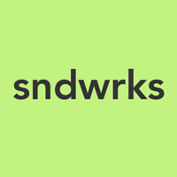
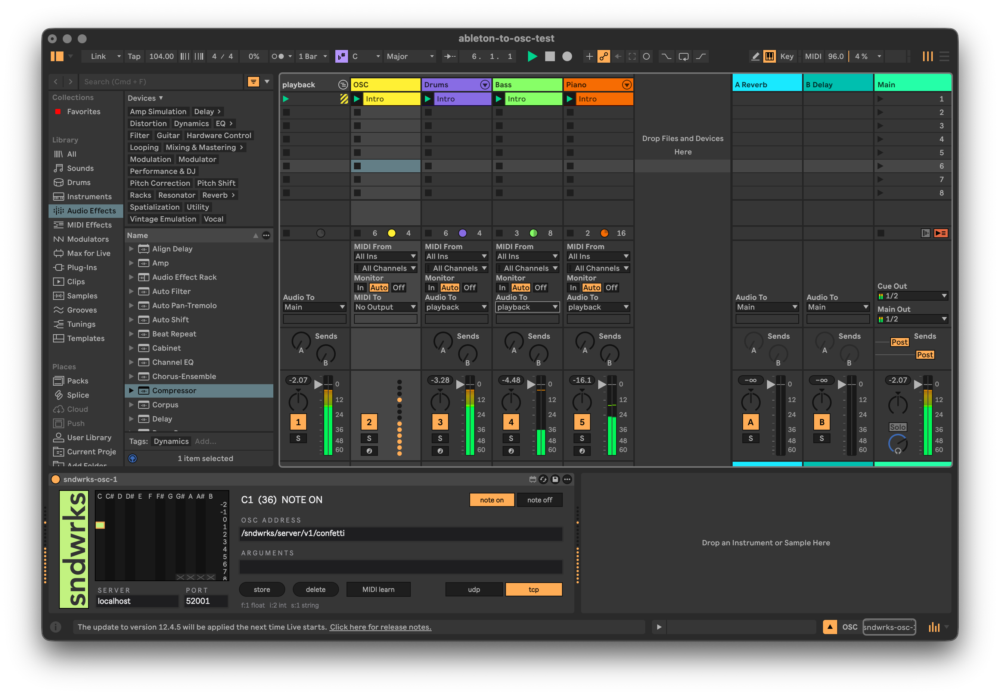

# ableton-osc

A Max for Live MIDI effect that turns notes into OSC. We leveraged LLMs to help build this repo.

Built for [sndwrks local](https://www.sndwrks.com/software), but it just sends TCP or UDP OSC.



## What it does

```
  Live clip / keyboard
          │  MIDI
          ▼
  ┌───────────────────────────────────────────────┐
  │  sndwrks-osc.amxd                             │
  │                                               │
  │   note 36 ──► coll lookup ──► /an/osc/message │
  │                                               │
  └───────────────────┬───────────────────────────┘
                      │  OSC over UDP or TCP
                      ▼
                  osc listener
```

- 128 notes, each with a separate **note on** and **note off** address
- UDP or TCP with SLIP framing
- Typed arguments — `f:1` float, `i:2` int, `s:1` string
- Mappings save with the Live Set, not with the device

## Requirements

- macOS
- Ableton Live Suite, or Live Standard with the **Max for Live** add-on


## Install

Download the latest `sndwrks-osc-*.zip` from [Releases](../../releases) and unzip it.

**Right-click `install.command` → Open**, then **Open** again when macOS warns about
an unidentified developer. A plain double-click gets refused outright rather than
offering you the choice, because the file came off the internet. Code signing is on
the list.

Restart Live, then drag **sndwrks-osc** onto a MIDI track from
**User Library → Presets → MIDI Effects → Max MIDI Effect**.

```bash
./install.command --help       # options
./install.command --dry-run    # say what would happen, copy nothing
./install.command --dest PATH  # if your User Library lives somewhere else
./install.command --force      # replace what's there without asking
```

### By hand

Copy all six of these into
`~/Music/Ableton/User Library/Presets/MIDI Effects/Max MIDI Effect/`:

```
sndwrks-osc.amxd   sndwrksMap.js   sndwrksGrid.js
sndwrksLogo.js     sndwrksTcp.js   package.json
```

> [!IMPORTANT]
> All six, not just the `.amxd`. The device isn't frozen, so it looks for those four
> scripts on Max's search path when it loads. Drop the `.amxd` in on its own and Max
> loads the `[js]` and `[v8ui]` objects with one outlet each, throws away the patch
> cords to the outlets it couldn't find, and doesn't put them back when the files
> show up later.

To uninstall, delete those six files. Nothing is written anywhere else, and your
mappings live in the Live Sets rather than in the install.

## Using it

**Click a cell** in the grid to pick a note — pitch classes across the top, octaves
down the right gutter. Lime cells are mapped. The four hatched cells past B8 are
dead, because there's no MIDI note above 127.

**MIDI learn** arms the selector, so you can just play the key you mean.

Type an **OSC address** and any **arguments**, then **store**. The **note on / note
off** tab picks which layer you're editing.

Type your server's IP into **SERVER**. Pasting a whole `host:port` works — it splits,
and applies the port to whichever transport is active. The **udp / tcp** tab swaps
**PORT** to show the one that transport is using; each remembers its own.

### Argument types

Types are inferred: `1` is an int, `1.5` a float, anything else a string. Force it
with a prefix:

```
f:1     float 1.0
i:2     int 2
s:1     the string "1"
```

`f:` matters more than it looks — lighting consoles care a great deal about `i`
versus `f`.

## Development

```bash
python3 build-patch.py   # regenerate sndwrks-osc.maxpat and sndwrks-osc.amxd
npm install
npm run lint             # eslint IS the formatter here, there's no Prettier
npm test                 # OSC/SLIP round-trip, persistence codec, installer
```

Edit `build-patch.py`, not the `.maxpat` JSON. The script asserts the things that
are easy to break by hand: no dangling cords, unique parameter names, whole-pixel
rects, nothing taller than Live's fixed 169px, and the pattr metadata that
persistence depends on.

| File | What it is |
|---|---|
| `sndwrks-osc.amxd` | The device. Generated by `build-patch.py`. |
| `sndwrksMap.js` | Mapping editor. Runs in `[js]`, which is ES5-only. Owns persistence. |
| `sndwrksGrid.js` | The note grid. Runs in `[v8ui]`. |
| `sndwrksLogo.js` | Wordmark strip. `[v8ui]`, drawing letterform data baked in by `tools/svgToMgraphics.py`. |
| `tools/sndwrks-logo.svg` | The wordmark artwork those letterforms are traced from. |
| `sndwrksTcp.js` | TCP transport. Runs in `[node.script]`. |
| `install.command` | The installer. `.command` so Finder will run it on a double-click. |
| `build-patch.py` | Generates the `.maxpat` and the `.amxd`. |

Every PR to `main` runs lint, all three test suites and `build-patch.py`. The
installer's own tests need a macOS runner, since the thing they test is macOS-only;
off macOS that suite reports a skip.

Releases are cut by pushing to `release`:

```bash
git switch release && git merge main && git push
```

That builds the zip and publishes it.

See [NOTES.md](NOTES.md) for how the device actually works, and for the pile of Max
and Live behaviours that cost real time to find.

Contributions are welcome — [CONTRIBUTING.md](CONTRIBUTING.md) covers branch naming,
the PR process, and the runtime rules that catch people out.

## License

MIT. See [LICENSE](LICENSE).

The MIT grant covers the code. It does not cover the sndwrks name, the sndwrks
wordmark or the logo — including `images/sndwrks-square_200px-high.png`,
`tools/sndwrks-logo.svg`, and the letterform outlines baked into `sndwrksLogo.js`.
The artwork is in the tree so the generated letterform block can be reproduced from
a clone, not as an invitation to reuse the mark. Fork the device freely; please put
your own on it rather than shipping ours.

## Not affiliated with Ableton

This is an independent project. It is not affiliated with, authorised by, or
endorsed by Ableton AG. Ableton, Ableton Live and Max for Live are trademarks of
Ableton AG, and Max is a trademark of Cycling '74; they are used here only to say
what this device runs in.
